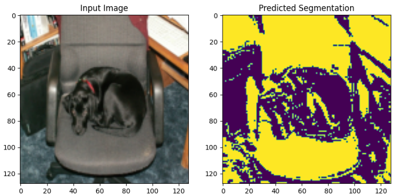
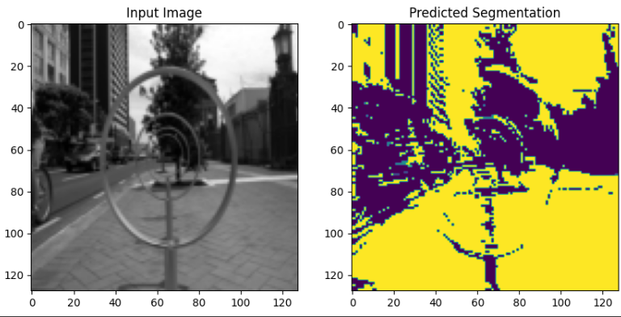
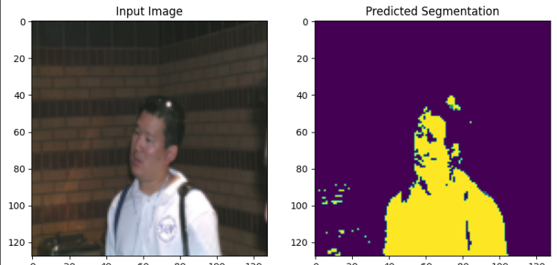
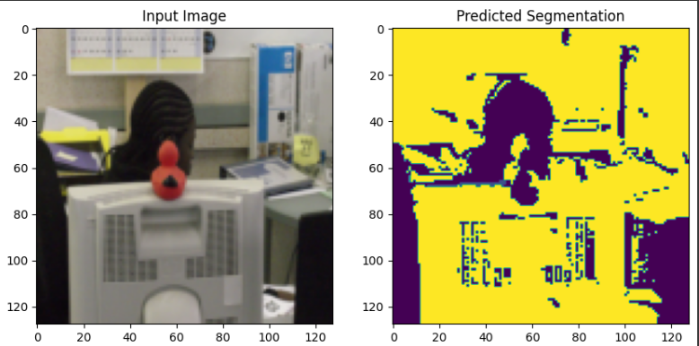
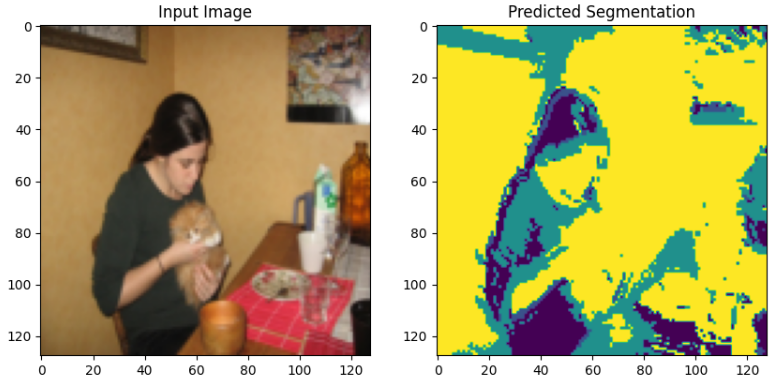

# FCN_KAN
Мы представляем вам модель основаную на архитектуре Fully-Convolutional-Network с заменёными Conv слоями.В нашей реализации Conv слои заменеын на Conv_KAN слои из репозитория https://github.com/AntonioTepsich/Convolutional-KANs.
(Подробнее с архитектурой и другими моментами можно ознакомиться в тех.отчёте - )
# Примеры работы модели в задаче сегментации изображений на датасете Pascal Voc.

